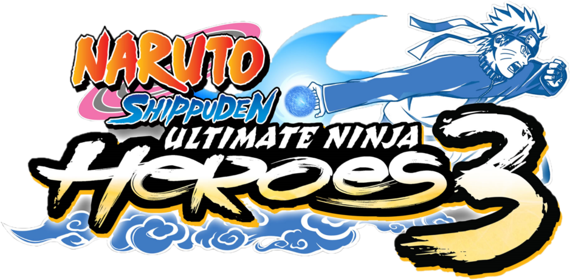

# Naruto Shippūden: Ultimate Ninja Heroes 3 GUIDE Modding

Este repositório contém informações detalhadas sobre a estrutura dos arquivos e pastas presentes na ISO do jogo **Naruto Shippūden: Ultimate Ninja Heroes 3**. O objetivo é servir como um guia para modding, facilitando a modificação e personalização do jogo.

---

## Estrutura Geral da ISO

A ISO é composta por:

- **PSP_GAME/** - Contém todos os arquivos importantes do jogo.
- **UMD_DATA.BIN** - Não possui relevância para modding por enquanto.

---

## Conteúdo da Pasta `PSP_GAME`

### Arquivos no Diretório Raiz

- **ICON0.PNG**  
  Ícone representativo do jogo *Naruto Shippūden: Ultimate Ninja Heroes 3*.

- **ICON1.PMF**  
  Arquivo de vídeo no formato PSMF (PlayStation Movie Format). Ele pode conter vídeos, cutscenes ou outros conteúdos.

- **PARAM.SFO**  
  Arquivo SFO (System File Object) utilizado pelo XMB para exibir informações e funcionalidades específicas ao executar o conteúdo.

- **PIC1.PNG**  
  Imagem ilustrativa do jogo.

- **SND0.AT3**  
  Pequeno arquivo de áudio, sem relevância para modding.

---

### Estrutura da Pasta `SYSDIR/`

- **EBOOT.BIN**  
  Arquivo ELF comprimido (executável principal do jogo).

- **BOOT.BIN**  
  Não possui relevância para modding.

- **OPNSSMP.BIN**  
  Função desconhecida, sem relevância para modding.

#### Arquivos Dentro da `SYSDIR/`:

- **EBOOT.BIN**  
  ELF comprimido para atualizações do jogo.

- **DATA.BIN**  
  Função desconhecida, sem relevância para modding.

---

### Estrutura da Pasta `USRDIR/`

A pasta **USRDIR** contém três subpastas e dois arquivos principais:

1. **Modules/**  
   - **libfont.prx**  
     Biblioteca de fontes.
   - **libsuppreacc.prx**  
     Função desconhecida, sem relevância para modding.

2. **Movie/**  
   - **logo_cc2.pmf**  
     Vídeo de introdução da CyberConnect2.
   - **logo_cri.pmf**  
     Logo da Criware.
   - **logo_nrt.pmf**  
     Conteúdo não utilizado.  
   - **MOVIE_01E.PMF** e similares:  
     Contêm as cutscenes do jogo.

3. **Sound/**  
   Não possui relevância, já que os arquivos de áudio estão nos arquivos **data.cpk** e **data.dns**.

- **data.cpk**  
  Contém arquivos dos personagens, menus e outros elementos principais.

- **data.dns**  
  Semelhante ao **data.cpk**, mas utilizado em atualizações no PSP.

---

## Descompactando o Arquivo `data.cpk`

Para descompactar o arquivo `data.cpk`, você precisará da ferramenta [YACpkTool](https://github.com/Brolijah/YACpkTool). Siga os passos abaixo:

1. Baixe a ferramenta no repositório do YACpkTool, seção **Releases**.
2. Extraia o arquivo `yacpktool.exe` e o coloque na mesma pasta do arquivo `data.cpk`.
3. Segure e arraste o arquivo `data.cpk` para o `yacpktool.exe`.  
   Isso irá descompactar o arquivo e gerar as pastas.

---

## Estrutura das Pastas Dentro do `data.cpk`

As pastas extraídas do **data.cpk** são:

- **00icon**  
- **01text**  
- **02boot**  
- **03font**  
- **04cmn**  
- **10loading**  
- **11mode**  
- **13adv**  
- **21btlsel**  
- **22vschr**  
- **30btlcmn**  
- **31btlstg**  
- **32btlchr**  
- **40skill**  
- **41spl**  
- **50btlend**  
- **sound**  

---------------------------------------------------------------------------------

### Estrutura das Pastas Dentro do **data.cpk**

#### **00icon**  
Contém os ícones do jogo.

#### **01text**  
- Os arquivos de texto podem ser modificados com a ferramenta [UNH3 Movie Script Editor](https://github.com/zMath3usMSF/UNH3MovieScriptEditor/releases).  
- Os arquivos **MOVIE_01** a **MOVIE_11** possuem múltiplas versões para diferentes idiomas:  
  - **movie_01.bin**: Japonês (original).  
  - **movie_01_e.bin**: Inglês.  
  - **movie_01_f.bin**: Francês.  
  - **movie_01_g.bin**: Alemão.  
  - **movie_01_i.bin**: Italiano.  
  - **movie_01_s.bin**: Espanhol.  

Recomenda-se editar a versão em inglês (**_e.bin**) para maior compatibilidade.  
Outros textos, como **text.bin**, podem ser modificados com a ferramenta [PSP-Naruto-Text-Editor](https://github.com/PauloDevv/PSP-Naruto-Text-Editor/releases).

---

#### **02boot**  
Arquivos de logo:
- **logo.ccs**  
- **logo_eu.ccs**  
- **logo_t.ccs**  
- **logo_us.ccs**  
Esses arquivos contêm as logos da Bandai Namco, Criware, entre outros.  
Para editar arquivos CCS, use a ferramenta [CCS File Explorer](https://github.com/zMath3usMSF/CCSFileExplorerRT/releases).

---

#### **03font**  
- **gf4.bin**: Fonte principal do jogo.  
- **gf4c.bin**: Arquivo de suporte para **gf4.bin**.

---

#### **04cmn**  
- **gauge.ccs**: Texturas que aparecem no jogo, como barras de energia.  
- **effect0x.ccs**: Efeitos visuais, principalmente em batalhas (jutsu de substituição, proteções, etc.).

---

#### **10loading**  
- **loading0.ccs**: Tela de carregamento principal.  
- **loading_us.ccs**: Versão localizada para o mercado norte-americano.

---

#### **11mode**  
Arquivos relacionados ao menu e modos de jogo:
- **dbgmenu.ccs**: Menu de depuração.  
- **install.ccs**, **install_us.ccs**, **install_use.ccs**: Texturas da instalação de dados.  
- **mdsel.ccs**: Texturas e modelos do menu de seleção.  
- **option.ccs**: Texturas do menu de opções.  
- **rec.ccs**: Texturas do menu de "Record".  
- **title.ccs** e **title_us.ccs**: Tela de título (animações, texturas e modelos).  

---

#### **13adv**  
Pasta destinada aos mapas e elementos do modo RPG:
- Arquivos de mapas do RPG: **r001.ccs** a **r029.ccs**.  
- Mapas do modo de combate livre: **s01.ccs** a **s22.ccs**.

---

#### **20wp**  
Contém texturas e wallpapers.

---

#### **22vschr**  
Fotos dos personagens que aparecem na tela de "VS".

---

#### **21btlsel**  
Arquivos do menu de seleção:
- **charsel1.ccs**: Texturas e modelos da seleção de personagens.  
- **custom1.ccs**: Opção de customização.  
- **mapsel1.ccs**: Menu de seleção de mapas (imagens e nomes).  
- **network.ccs**: Texturas do modo "Network".  
- **vs.ccs**: Texturas da tela de "VS" após a seleção.

---

#### **30btlcmn**  
Arquivos gerais das batalhas:
- **2cmnbod1.ccs**: Estrutura dos personagens para batalhas.  
- **battlegauge.ccs**: Texturas das barras de vida, shurikens, etc.

---

#### **32btlchr**  
Arquivos relacionados aos personagens:
- **2xxxbod1.ccs**: Modelos, texturas e animações dos personagens.  
- **2xxxcha0.ccs**, **2xxxcha1.ccs**: Jutsus 1 e 2 dos personagens.  
- **2xxxpct.ccs**: Nome e textura do personagem (tela de luta e ultimate jutsu).

---

#### **40skill**  
Texturas e jutsus (não relacionados aos personagens principais).

---

#### **41spl**  
Contém animações, modelos e texturas dos "Ultimate Jutsus" de cada personagem.

---

#### **50btlend**  
- **battleresult.ccs**: Texturas da tela de resultados das batalhas.

---

#### **Sound**  
- **plvoice.afs**: Vozes dos personagens.  
- **evvoice.afs**: Vozes do modo história.  
- **bgm.afs**: Trilha sonora e músicas.  
- **stream.afs**: Vozes dos "Ultimate Jutsus".  

Além disso, a pasta contém sons adicionais dos personagens.

---

### Observação:
Ainda vou documentar o conteúdo dessas pastas em mais detalhes.

---

Contribuições para este guia são bem-vindas! Se você tem conhecimento sobre os arquivos do jogo ou deseja expandir as informações contidas aqui, sinta-se à vontade para abrir um pull request. 😊
